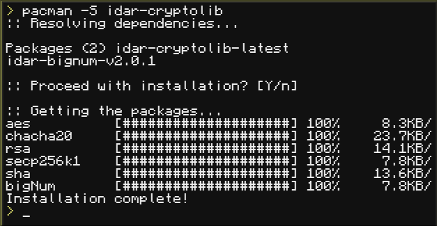

# iDar-Pacman


**The definitive package manager for ComputerCraft: Tweaked.**

> _"I use Arch btw... and now my turtles do too."_

**iDar-Pacman** brings the power, aesthetics, and logic of Arch Linux's `pacman` to CC: Tweaked. Unlike simple download scripts, iDar-Pacman is a fully-featured package manager capable of **resolving complex dependency trees**, managing versioning, and handling system updates intelligently.

It serves as the backbone of the **iDar Ecosystem**, ensuring that libraries like [`iDar-CryptoLib`](https://github.com/DarThunder/iDar-CryptoLib) and [`iDar-BigNum`](https://github.com/DarThunder/iDar-BigNum) are installed correctly with all their requirements.

## Table of Contents

- [Features](#features)
- [Installation](#installation)
- [Usage](#usage)
  - [Basic Commands](#basic-commands)
  - [The Update Cycle](#the-update-cycle)
- [For Developers](#for-developers)
  - [Creating a Package](#creating-a-package)
  - [Manifest Specification](#manifest-specification)
- [FAQ](#faq)
- [License](#license)

## Features

- **True Dependency Resolution**: Automatically detects, downloads, and installs required libraries for any package (recursive resolution).
- **Arch Linux Aesthetics**: Pixel-perfect recreation of the CLI experience, including progress bars, operation tags (`::`), and the sacred `[Y/n]` prompt.
- **Transactional Hooks**: Uses a **fake_root** environment to safely execute post-install scripts. Changes are only committed if the hook succeeds.
- **Smart Upgrades (`-Syu`)**: Compares your local versions against the remote database to perform necessary updates only.
- **Sandboxed Manifests**: Loads package metadata in a restricted environment to prevent malicious code execution during dependency checks.
- **Clean Filesystem**: Organizes packages efficiently within the `/iDar/` directory hierarchy.

## Installation

To bootstrap **iDar-Pacman** on your computer or turtle, run the following command:

```lua
wget run [https://raw.githubusercontent.com/DarThunder/iDar-Pacman/refs/heads/main/installer.lua](https://raw.githubusercontent.com/DarThunder/iDar-Pacman/refs/heads/main/installer.lua)
```

_Note: This will install the base system and create the necessary directory structures._

## Usage

The syntax is designed to be immediately familiar to any Linux user.

### Basic Commands

Based on the latest version, these are the supported operations:

| Operation   | Flag                 | Description                                       |
| :---------- | :------------------- | :------------------------------------------------ |
| **Install** | `pacman -S <pkg>`    | Installs a package and its dependencies.          |
| **Remove**  | `pacman -R <pkg>`    | Uninstalls a package (keeps dependencies).        |
| **Cleanup** | `pacman -Rns <pkg>`  | Uninstalls a package and its unused dependencies. |
| **Search**  | `pacman -Ss <query>` | Searches the remote database for packages.        |
| **Query**   | `pacman -Q`          | Lists all locally installed packages.             |
| **Orphans** | `pacman -Qtdq`       | Lists dependencies that are no longer needed.     |
| **Sync DB** | `pacman -Syy`        | Forces a refresh of the package database.         |
| **Upgrade** | `pacman -Syu`        | Syncs DB and performs a full system upgrade.      |

### Example: Installing a Library



As you can see, Pacman automatically resolved `idar-bignum` as a requirement.

### The Update Cycle

Just like in real life, keep your system updated to get the latest bug fixes and features for your libraries.


## For Developers

Want to distribute your own programs via iDar-Pacman? You need to create a `manifest.lua` file in your repository.

### Manifest Specification

The manifest tells Pacman where to put your files, what other packages you need, and can optionally run installation hooks.

**Example `manifest.lua`:**

```lua
return {
    -- The directory inside /iDar/ where files will be saved
    directory = "MyProgram",

    -- List of source files to download relative to your repo root
    files = {
        ["src"] = {
            "main.lua",
            ["api"] = {
                "utils.lua"
            }
        }
    },

    -- Dependencies that must be installed
    dependencies = {
        { name = "idar-bignum", version = "v2.0.1" }
    },

    -- Optional: Post-installation hooks (runs in fake_root)
    hooks = {
        {
            name = "generate_config",
            script = [[
                local f = fs.open("/iDar/MyProgram/config.cfg", "w")
                f.write("default_theme=dark")
                f.close()
            ]]
        }
    }
}
```

To get your package added to the global registry, submit a Pull Request to the **[iDar-Pacman-DB](https://github.com/DarThunder/iDar-Pacman-DB)** repository.

## FAQ

**Q: Can I install `npm` packages with this?**
A: No. If you want to download 12GB of `node_modules` to check if a number is odd, you are in the wrong mod. We optimize for storage here.

**Q: Is the "lag" during download real?**
A: The download speed simulates realistic network conditions via `os.sleep` and random variance. It's for immersion (and to prevent server spam).

**Q: Does it support AUR?**
A: A man can dream. For now, the official repository is the only source of truth (and 3rd party repos).

**Q: Why create this when `pastebin get` exists?**
A: Because managing 6 different libraries with manual `wget` commands is a nightmare. iDar-Pacman handles the dependency hell so you don't have to.

## Current Packages in Ecosystem

- [iDar-BigNum](https://github.com/DarThunder/iDar-BigNum) - Arbitrary precision arithmetic Library
- [iDar-CryptoLib](https://github.com/DarThunder/iDar-CryptoLib) - Cryptographic suite
- [iDar-Codecs](https://github.com/DarThunder/iDar-Codecs) - Compression Library
- [iDar-Structures](https://github.com/DarThunder/iDar-Structures) - Data structures Library
- [iDar-DB](https://github.com/DarThunder/iDar-DB) - Embedded and lightweight database (WIP)
- [Add yours\!](#for-developers)

## License

This project is licensed under the MIT License. See the [LICENSE](LICENSE) file for details.
