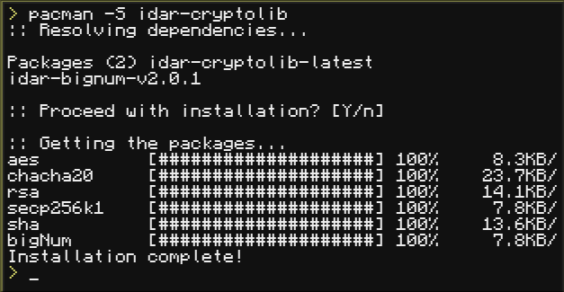
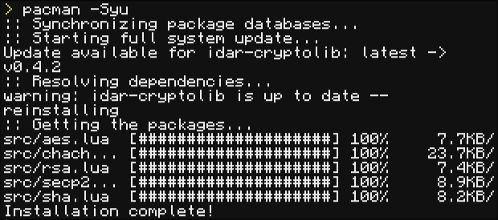

# iDar-Pacman


**The definitive package manager for the iDar-Loom Microkernel.**

> _"I use Arch btw... and now my turtles do too."_

**iDar-Pacman** brings the power, aesthetics, and logic of Arch Linux's `pacman` to CC: Tweaked. Unlike simple download scripts, iDar-Pacman is a kernel-aware package manager built to run exclusively within the **iDar-Loom** environment. It leverages Loom's multitasking and isolation capabilities to resolve complex dependency trees, manage versioning, and handle system updates with total safety.

## Requirements

iDar-Pacman **cannot** run on vanilla ComputerCraft: Tweaked. It is strictly dependent on the **[iDar-Loom Kernel](https://github.com/DarThunder/iDar-Loom)** due to its heavy reliance on kernel-level syscalls:

- **Virtual File System (VFS):** Uses the `sys` API (`sys.open`, `sys.write`, etc.) for I/O abstraction and process isolation.
- **Process Management:** Utilizes `sys.spawn`, `sys.wait`, and `sys.kill` to execute manifests and installation hooks in isolated sandboxes.
- **FHS Compliance:** Relies on Loom's VFS structure to manage global binaries in `/bin/` and libraries in `/lib/` or `/opt/`.

## Table of Contents

- [Features](#features)
- [Installation](#installation)
- [Usage](#usage)
- [For Developers](#for-developers)
- [FAQ](#faq)
- [License](#license)

## Features

- **True Dependency Resolution**: Automatically detects, downloads, and installs required libraries recursively.
- **Arch Linux Aesthetics**: Pixel-perfect CLI experience with progress bars and the iconic `[Y/n]` prompt.
- **Kernel-Level Sandboxing**: Uses Loom's `sys.spawn` to run post-install hooks in a `fake_root` environment. If a script hangs or fails, the kernel kills the process without affecting the system.
- **Smart Upgrades (`-Syu`)**: Compares local versions against remote databases for intelligent system-wide updates.
- **Global Linker**: Automatically creates `.ptr` command links in `/bin/` for any package with executable binaries.

## Installation

Inside an active **iDar-Loom** session, run the bootstrap command:

```lua
wget run https://raw.githubusercontent.com/DarThunder/iDar-Pacman/refs/heads/main/installer.lua
```

## Usage

| Operation   | Flag                 | Description                                       |
| :---------- | :------------------- | :------------------------------------------------ |
| **Install** | `pacman -S <pkg>`    | Installs a package and its dependencies.          |
| **Remove**  | `pacman -R <pkg>`    | Uninstalls a package (keeps dependencies).        |
| **Cleanup** | `pacman -Rns <pkg>`  | Uninstalls a package and its unused dependencies. |
| **Search**  | `pacman -Ss <query>` | Searches the remote database for packages.        |
| **Query**   | `pacman -Q`          | Lists all locally installed packages.             |
| **Sync DB** | `pacman -Syy`        | Forces a refresh of the package database.         |
| **Upgrade** | `pacman -Syu`        | Syncs DB and performs a full system upgrade.      |

## Example: Installing a Library



As you can see, Pacman automatically resolved `idar-bignum` as a requirement.

### The Update Cycle

Just like in real life, keep your system updated to get the latest bug fixes and features for your libraries (or add new ones and have your system broken for days!!!!) .



## For Developers

To distribute programs, you must provide a `manifest.lua`. Pacman evaluates this file using a sandboxed `sys.spawn` call to ensure it doesn't contain malicious code that could escape the installer.

**Example `manifest.lua`:**

```lua
return {
    directory = "MyProgram",
    files = {
        ["main.lua"] = "src/main.lua"
    },
    bin = {
        ["myprogram"] = "src/main.lua"
    },
    dependencies = {
        { name = "idar-bignum", version = "v2.0.1" }
    },
    hooks = {
        {
            name = "setup",
            script = [[ sys.write(1, "Setting up...") ]]
        }
    }
}
```

To get your package added to the global registry, submit a Pull Request to the **[iDar-Pacman-DB](https://github.com/DarThunder/iDar-Pacman-DB)** repository.

## FAQ

**Q: Can I use this in a normal computer?**
A: No. `sys` is a Loom-specific global. Without the kernel, Pacman won't find the necessary syscalls to manage files or processes.

**Q: Why so much complexity?**
A: Because standard CC:T lacks a way to safely run untrusted installation scripts. By using Loom's scheduler, we can time-out or kill buggy installers.

**Q: Why create this when `pastebin get` exists?**
A: Because managing 11 different libraries (and a OS but who counts?)
with manual `wget` commands is a nightmare. iDar-Pacman handles the
dependency hell so you don't have to.

## Current Packages in Ecosystem

- [iDar-BigNum](https://github.com/DarThunder/iDar-BigNum) - Arbitrary precision arithmetic Library
- [iDar-CryptoLib](https://github.com/DarThunder/iDar-CryptoLib) - Cryptographic suite
- [iDar-Codecs](https://github.com/DarThunder/iDar-Codecs) - Compression Library
- [iDar-Structures](https://github.com/DarThunder/iDar-Structures) - Data structures Library
- [iDar-DB](https://github.com/DarThunder/iDar-DB) - Embedded and lightweight database (WIP)
- [Add yours\!](#for-developers)

## License

This project is licensed under the MIT License. See the [LICENSE](LICENSE) file for details.
